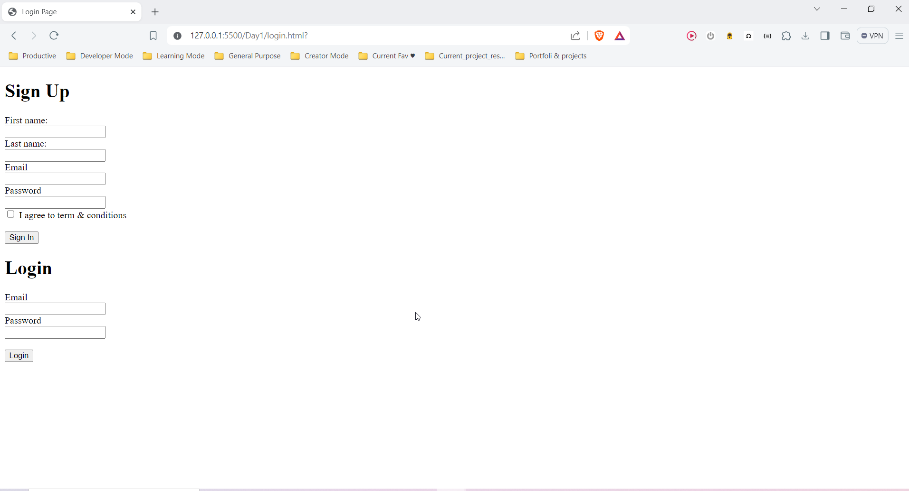

# Learning From Day 1 of ILP 

### The basics of how the internet works:


**DNS (domain name system):-** it is the phonebook of the Internet. 


**Internet:** The internet is a global network of linked computers, phones, servers, and smart appliances that communicate with each other using the transmission control protocol (TCP) standard.


**Web Working:** When we request any website on the internet, the internal workings look like this:


www.google.com (http request) -> DNS -> Get IP address -> Request to server belong to IP addreess -> Get Response from Server -> Browser show website content.


### HTML (HyperText Markup Language)

**What is Html :** It is used to build web pages. HTML defines the structure and content of web pages, and HTML elements tell the browser how to display the content.

_Examples:_

```HTML
<!DOCTYPE html>
<html>
<head>
<title>Page Title</title>
</head>
<body>

<h1>This is a Heading</h1>
<p>This is a paragraph.</p>

</body>
</html>

```

***HTML Elements:*** HTML elements look like this -

`<tagname>` Content goes here...`</tagname>`

_Example:_

```HTML
<h1>Heading Tag</h1>
<p>paragraph Tag</p>
```

***HTML Attributes:***: HTML attributes provide additional information about HTML elements.

For Example - The `<a> `tag defines a hyperlink. The href attribute specifies the URL of the page the link goes to:

_code_

```HTML
<a href="https://www.example.com">Visit Website</a>

```

### Building Login & Sign Up Page from HTML learning

```HTML
<!DOCTYPE html>
<html lang="en">
<head>
    <meta charset="UTF-8">
    <meta name="viewport" content="width=device-width, initial-scale=1.0">
    <title>Login Page</title>
</head>
<body>
    
    <h1>Sign Up</h1>
    <form action="">
        <label for="fname">First name:</label><br>
        <input type="text" id="fname">
        <br>
        <label for="lname">Last name:</label><br>
        <input type="text" id="lname">
        <br>
        <label for="email">Email</label><br>
        <input type="email" id="email">
        <br>
        <label for="password">Password</label><br>
        <input type="password" id="password">
        <br>
        <input type="checkbox" id="t&c">
        <label for="t&c">I agree to term & conditions</label><br><br>
        <input type="submit" value="Sign In">
    </form>


    <h1>Login</h1>
    <form action="">
        <label for="email">Email</label><br>
        <input type="email" id="email">
        <br>
        <label for="password">Password</label><br>
        <input type="password" id="password"><br><br>
        <input type="submit" value="Login">
    </form>

</body>
</html>

```

### Output 

