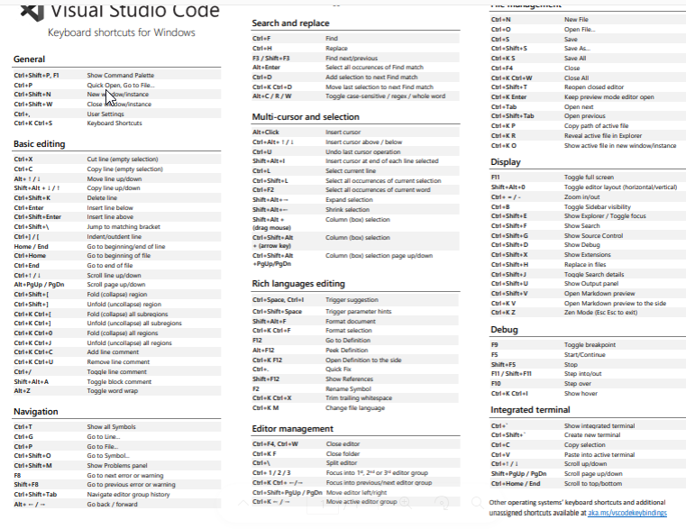

# Learning of Day 2 of ILP

## 1 Basic of Vs Code 

***what is Vscode***

Ans - Visual Studio Code, also commonly referred to as VS Code, is a source-code editor developed by Microsoft for Windows, Linux and macOS. Features include support for debugging, syntax highlighting, intelligent code completion, snippets, code refactoring, and embedded version control with Git.

***vscode keyboard shortcuts***

There are a lot of shortcuts that help developers during their work in vs code, so some of them are:



## Learning about CSS 

***What is CSS***

_Cascading Style Sheets is a style sheet language used for specifying the presentation and styling of a document written in a markup language such as HTML or XML_

***CSS Syntax***

Selector {Declaration ; Declaration}

_Example_ 

```CSS
h1 { color: bule; font-size: 12px;}
   (property) (value)
```

***CSS Selectors***

_For Id_

```CSS
#para1 {
  text-align: center;
  color: red;
}
```
_For Class_

``` CSS
.center {
  text-align: center;
  color: red;
}
```

***Adding CSS***


_Three Ways to Insert CSS_

### External CSS

```HTML
<link rel="stylesheet" href="mystyle.css">
```
### Internal CSS

```HTML
<style>
body {
  background-color: linen;
}

h1 {
  color: maroon;
  margin-left: 40px;
}
</style>
```

### Inline CSS

```HTML
<h1 style="color:blue;text-align:center;">Heading CSS</h1>
<p style="color:red;">Paragraph CSS.</p>
```

## practical 

_Adding css to Day1 Login Page_

```CSS
body{
    background-color: #5883f9;
}

.main {
    margin-top: 80px;
    margin-left: 18%;
    margin-right: 18%;
}

.flex {
    display: flex;
    justify-content: space-around;
    
}

.login_form {
    width: 400px;
    height: 600px;
    background-color: white;
    border-radius: 10px;
    
}

.form {

    margin-top: 20px;
    flex-direction: column;
    align-items: center;
}

.form a {
    text-decoration: none;
    margin-top: 8px;
}

.form .button {
    background-color: #356aff;
    color: white;
    cursor: pointer;
}

.input_box {
    margin-top: 20px;
    height: 40px;
    width: 350px;
    border-radius: 5px;
}
```


***Output After CSS***


